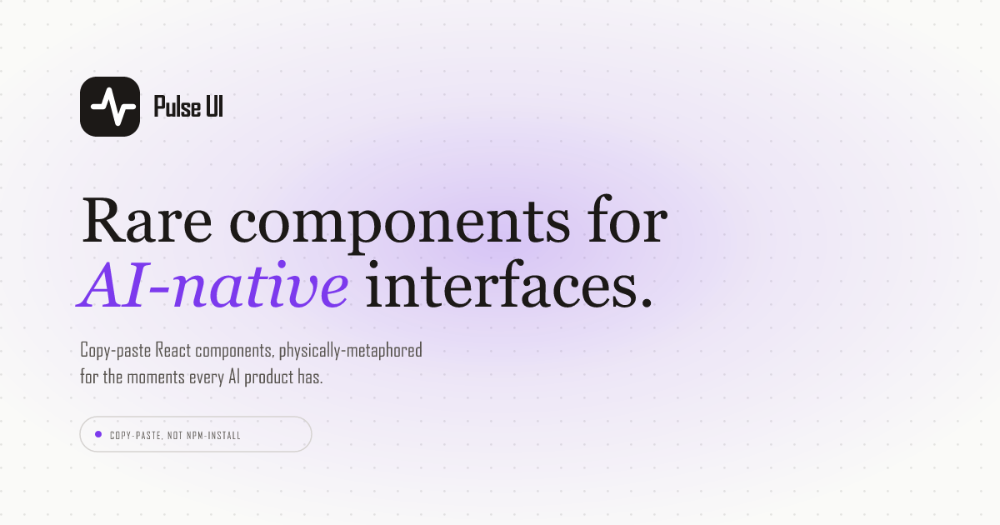

# Pulse UI



Rare, physically-metaphored React components for AI-native interfaces.

Every AI product ships the same flat moments — a spinner for "thinking", a plain bar for context usage, a green/red diff, a hedge badge for low confidence. Pulse UI takes those exact moments and renders them so they stop a scroll: particles that converge as the model settles, a context bar that sloshes like liquid in glass, a diff that scatters its removed characters, agents as flocks of light.

**Copy-paste, not npm-install.** Each component is one file with zero dependencies (plain `<canvas>` or CSS). You paste it into your project and own the code — the same model as shadcn/ui.

## Components

| Component | The moment |
|---|---|
| **Thinking Indicator** | A loose particle field that drifts, then converges into a point as the model settles. |
| **Confidence Text** | Confident words are sharp ink; uncertain ones sit out of focus under a heat-haze until verified. |
| **Context Meter** | A progress bar where the fill is liquid — sloshes on big jumps, boils near the limit, overflows past it. |
| **Code Diff** | A standard diff until accepted, then a beam sweeps down and it becomes the code. Reject and it blows away. |
| **Agent Status** | Parallel agents as flocks orbiting a progress ring; each streams into the core as it finishes. |
| **Regenerate** | Hitting regenerate rewinds the old answer like tape before the new one streams in. |
| **Timer** | A spinner-sized ring of ticks — a sweeping head and a counting clock, or a filling progress ring. |
| **Streaming Text** | Streaming text you can see arrive — each chunk lands as vapour and condenses into ink. |
| **Tool Call** | A tool call as a signal on a circuit trace: the pulse rides out, the pad ignites while it runs, the result rides back. |
| **Hold to Allow** | A permission prompt with a fuse in the Allow button — hold and it burns across; let go early and it recedes. |
| **Image Reveal** | A generated image arriving as a field of dots that drift, then lock onto a grid until the real picture fades in. |
| **File Chunker** | A document being prepared for retrieval — the page fills as it's read, strips peel off onto a deck, embedding lights each one. |

Every component has a live preview, controls, usage snippet and its full source on the site.

## Using a component

1. Open the component page on the site.
2. Copy the source block into `src/components/<Name>.jsx` in your project.
3. Import it.

```jsx
import ThinkingIndicator from './components/ThinkingIndicator';

<ThinkingIndicator settled={!isStreaming} />
```

Requirements: React 18+. No Tailwind, no animation library, nothing else.

## Running the site locally

The site and the components live in `client/`.

```bash
cd client
npm install
npm run dev
```

`npm run build` produces the static site; `npm run lint` runs oxlint.

## Project layout

```
client/src/
  components/        the library — one self-contained file per component
  registry.js        every component: slug, name, description, preview, raw source
  pages/components/  one docs page per component (preview, controls, props)
  lib/               site helpers: DocPage shell, ComponentCard, previews, CodeBlock
  sections/          homepage sections
  layout/            header + footer
```

## License

[MIT](LICENSE) — use them anywhere, credit appreciated but not required.
